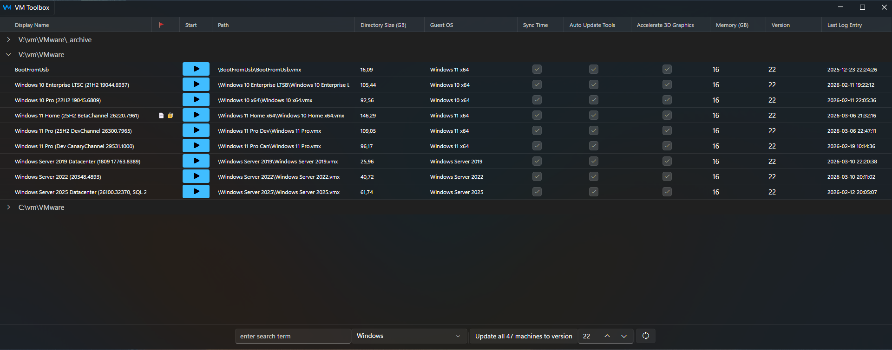

VmMachineHwVersionUpdater

"Vm Machine Hardware Version Updater" is a small tool to manage VMware and VirtualBox machine properties such as changing the hardware version of multiple machines without editing the configuration files manually.

Features:

- Change hardware version of one or more machines
- Enable/disable "Synchronize guest time with host"
- Tools upgrade policy switch (upgradeAtPowerCycle/useGlobal)
- Multi-Pool aware by adding paths inside the settings section
- Archive functionality
- Add/edit annotations (VMware Workstation only)
- Start machine
- Open configuration file in VS Code
- Jump to path

[User & Contributing Guide](/docs/User-Guide.md) | [Solution Architecture](/docs/Solution-Architecture.md)

| main                                                                                                                                                                                                           | develop                                                                                                                                                                                                              |
| -------------------------------------------------------------------------------------------------------------------------------------------------------------------------------------------------------------- | -------------------------------------------------------------------------------------------------------------------------------------------------------------------------------------------------------------------- |
|  |  |