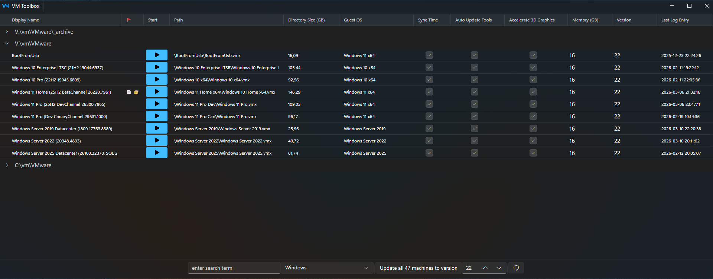

# VmMachineHwVersionUpdater

"Vm Machine Hardware Version Updater" is a small tool to manage VMware and VirtualBox machine properties such as changing the hardware version of multiple machines without editing the configuration files manually.

## Features:

- Change hardware version of one or more machines
- Enable/disable "Synchronize guest time with host"
- Tools upgrade policy switch (upgradeAtPowerCycle/useGlobal)
- Multi-Pool aware by adding paths inside the settings section
- Archive functionality
- Add/edit annotations (VMware Workstation only)
- Start machine
- Open configuration file in VS Code
- Jump to path

[User & Contributing Guide](/docs/User-Guide.md) | [Solution Architecture](/docs/Solution-Architecture.md)

## Package Feeds

Default by `NuGet.config` is myget.org

| Feed                           | Feed Url                                                         |
| :----------------------------- | :--------------------------------------------------------------- |
| ![myget.org][myGetBadge]       | <https://www.myget.org/F/evilbaschdi/api/v3/index.json>          |
| ![codeberg.org][codebergBadge] | <https://codeberg.org/api/packages/evilbaschdi/nuget/index.json> |

## Quality & Activity

| Branch                                | Status & Activity                                                                                                                                                        |
| :------------------------------------ | :----------------------------------------------------------------------------------------------------------------------------------------------------------------------- |
| ![Main Branch][mainBranchBadge]       | [![CodeFactor][codeFactorMainBadge]][codeFactorMainOverview] ![Commit Activity Main][commitActivityMainBadge] ![Last Commit Main][lastCommitMainBadge]                   |
| ![Develop Branch][developBranchBadge] | [![CodeFactor][codeFactorDevelopBadge]][codeFactorDevelopOverview] ![Commit Activity Develop][commitActivityDevelopBadge] ![Last Commit Develop][lastCommitDevelopBadge] |

---

## ⚖️ Disclaimer

This project is a community-maintained open-source tool and is **not** affiliated with, endorsed by, sponsored by, or associated with Broadcom Inc., VMware Inc., Oracle Corporation, or any of their affiliates.

* **VMware**, **vSphere**, **ESXi**, and related terms are registered trademarks of Broadcom Inc.
* **VirtualBox** and related terms are registered trademarks of Oracle Corporation and/or its affiliates.

All product names, logos, and brands mentioned within this repository are the property of their respective owners. They are used here solely for descriptive and informational purposes to indicate compatibility and interoperability.

[myGetBadge]: https://img.shields.io/badge/MyGet.org-gray?style=for-the-badge&logo=myget
[codebergBadge]: https://img.shields.io/badge/Codeberg-gray?style=for-the-badge&logo=codeberg

[mainBranchBadge]: https://img.shields.io/badge/branch-main-brightgreen?style=for-the-badge&logo=git&logoColor=white&color=c9ff00
[developBranchBadge]: https://img.shields.io/badge/branch-develop-blue?style=for-the-badge&logo=git&logoColor=white&color=0080ff

[codeFactorMainBadge]: https://www.codefactor.io/repository/github/evilbaschdi/VmMachineHwVersionUpdater/badge/main?style=for-the-badge
[codeFactorMainOverview]: https://www.codefactor.io/repository/github/evilbaschdi/VmMachineHwVersionUpdater/overview/main
[commitActivityMainBadge]: https://img.shields.io/github/commit-activity/m/evilbaschdi/VmMachineHwVersionUpdater/main?style=for-the-badge
[lastCommitMainBadge]: https://img.shields.io/github/last-commit/evilbaschdi/VmMachineHwVersionUpdater/main?style=for-the-badge

[codeFactorDevelopBadge]: https://www.codefactor.io/repository/github/evilbaschdi/VmMachineHwVersionUpdater/badge/develop?style=for-the-badge
[codeFactorDevelopOverview]: https://www.codefactor.io/repository/github/evilbaschdi/VmMachineHwVersionUpdater/overview/develop
[commitActivityDevelopBadge]: https://img.shields.io/github/commit-activity/m/evilbaschdi/VmMachineHwVersionUpdater/develop?style=for-the-badge
[lastCommitDevelopBadge]: https://img.shields.io/github/last-commit/evilbaschdi/VmMachineHwVersionUpdater/develop?style=for-the-badge