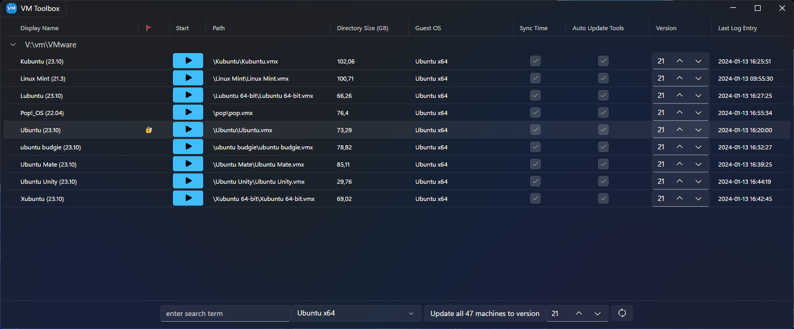

VmMachineHwVersionUpdater
=========================

"Vm Machine Hardware Version Updater" is a small tool to manage VMware machine properties such as changing the hardware version of multiple VMware machines without editing the ".vmx" file.

Features:
- Change hardware version of one or more machines
- Enable/disable "Synchronize guest time with host"
- Tools upgrade policy switch (upgradeAtPowerCycle/useGlobal)
- Multi-VMware pool aware by adding paths inside the settings section
- Archive functionality
- Add/edit annotations (VMware Workstation only)
- Start machine
- Open .vmx file in VS Code
- Jump to path

| main | develop |
| ------------- | ------------- |
|  |  |
