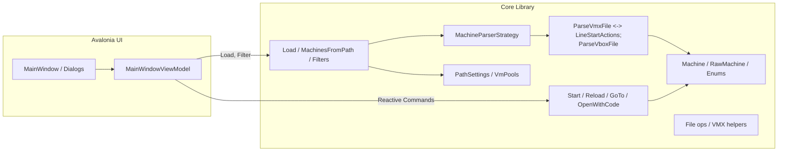
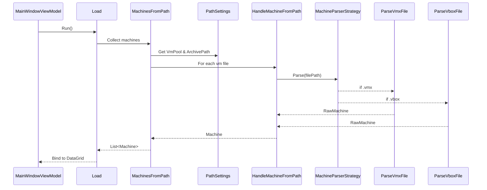

# VmMachineHwVersionUpdater – Solution Documentation

## Overview

VmMachineHwVersionUpdater is a .NET solution that inspects and manages VM configurations for VMware Workstation/Player (.vmx) and VirtualBox (.vbox). It offers a cross-platform UI built with Avalonia and a core library that parses, lists, and updates VM metadata.

Projects:

- VmMachineHwVersionUpdater.Core – domain models, parsing, commands, settings, DI.
- VmMachineHwVersionUpdater.Avalonia – desktop UI, view models, reactive commands, DI wiring.
- Tests – unit tests for Core and Avalonia layers.

## High-level Architecture

## Key Components

### Core Models

- RawMachine: immutable-ish DTO from parsing; fields like DisplayName, HwVersion, MemSize, CpuCount, OSType, VirtualBoxHwVersion, Annotation, etc.
- Machine: UI-bound model with behavior (toggle tools sync, update version/mem) and state (MachineState).
- MachineType, MachineState enums classify VMs and their states.

### Parsing Strategy

- MachineParserStrategy chooses parser by file extension (.vmx/.vbox).
- ParseVmxFile uses IVmxLineStartsWith and ILineStartActions to quickly map line prefixes to property setters (parallel per line for performance).
- LineStartActions centralizes the mapping of vmx keys to RawMachine mutations (annotation, guestos, memsize, encryption, etc.).
- ParseVboxFile loads XDocument, navigates VirtualBox namespace, and reads attributes (name, version, OSType) and nodes (Description, Memory, CPU).

### Discovery & Loading

- MachinesFromPath builds a list of VM files (vmx/vbox) from configured pools and archive paths, then handles them via IHandleMachineFromPath to produce Machine instances. Uses filtering via FileListFromPathFilter and can run in parallel.
- Load orchestrates fetching, transforming, and exposing collections for the UI, with filtering helpers (FilterItemSource, GuestOsesInUse, LoadSearchOsItems).

### Commands

- StartCommand, ReloadCommand, GoToCommand, OpenWithCodeCommand, and more—encapsulate user actions triggered from the UI.

### Settings & Configuration

- VmPools.json lists pools and archive paths; placeholders like {UserProfile} are resolved via ReplaceUserProfilePlaceholder and used by PathSettings.
- GuestOsStringMapping.json maps guest OS strings to display-friendly values.

### Dependency Injection

- Core services are registered via ConfigureCoreServices.
- Avalonia adds UI-specific services/VMs via ConfigureAvaloniaServices, ConfigureReactiveCommandServices, and ConfigureWindowsAndViewModels.
- App.axaml.cs wires all DI modules and creates the main window.

## Data Flow (Load to UI)

## Error Handling & Robustness

- Null guards on constructors and methods (ArgumentNullException.ThrowIfNull).
- TryParse patterns for ints when reading VMX/VBOX.
- Parallel loops use safe collections (e.g., ConcurrentBag) when aggregating.

## Performance Notes

- ParseVmxFile processes lines in parallel with a dictionary-like action lookup for O(1) key testing, short-circuiting when possible (e.g., detailed data only first hit).
- MachinesFromPath can parallelize both directory and file scanning; ensure logging/exception handling so one bad path doesn’t break the load.

## Extensibility

- Add new parsers by extending IMachineParserStrategy and implementing IParse… interfaces.
- Add new VMX keys by augmenting LineStartActions.
- New commands follow the existing command interfaces and DI wiring.

## Configuration & Cross-Platform Paths

- Use {UserProfile} placeholder in VmPools.json; resolved via ReplaceUserProfilePlaceholder to Environment.SpecialFolder.UserProfile, supporting Windows/Linux.
- Avoid hard-coded drive letters for Linux; prefer {UserProfile}/vm/… or similar base variables.

## Build & Run

- .NET 9 targeted; publish scripts exist for win-x64/win-arm64.
- UI project is Avalonia; desktop-style application via IClassicDesktopStyleApplicationLifetime.

## Files of Interest

- Core: Strategies/MachineParserStrategy.cs, PerMachine/ParseVmxFile.cs, PerMachine/ParseVboxFile.cs, PerMachine/LineStartActions.cs, BasicApplication/MachinesFromPath.cs, Settings/*.json
- UI: App.axaml(.cs), Views/MainWindow.axaml(.cs), ViewModels/MainWindowViewModel.cs, DI in Avalonia/DependencyInjection/*

## Future Improvements

- Add structured logging (e.g., Serilog) with context for path/file processing.
- Unit tests for ParseVboxFile and MachineParserStrategy edge cases.
- Async I/O for large directory scans; cancellation support from UI.
- Consolidate publish scripts and add CI build steps.

---

Generated automatically; update as architecture evolves.
